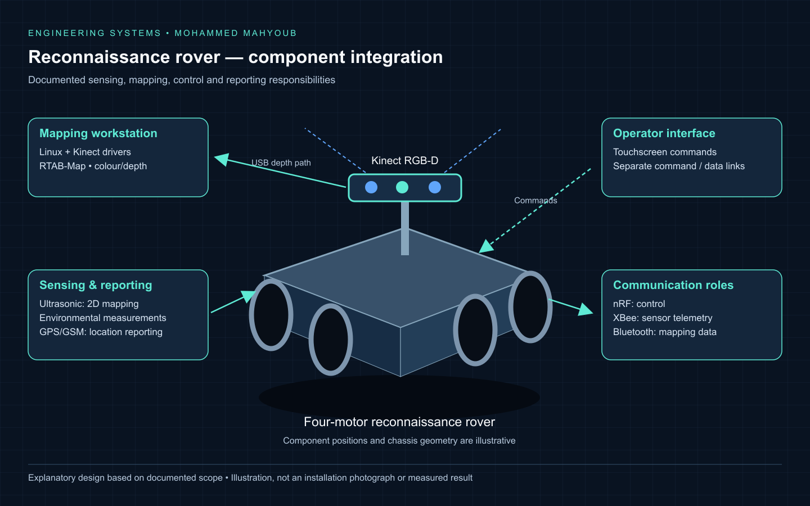
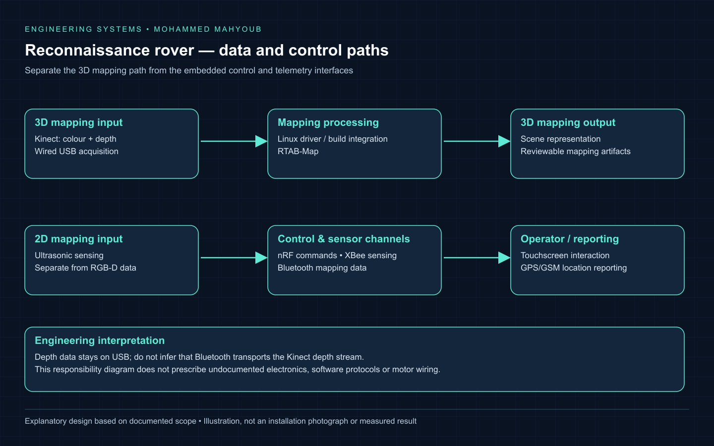
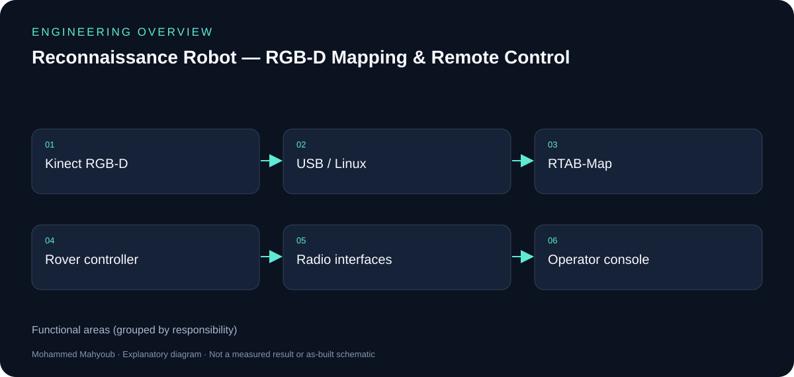
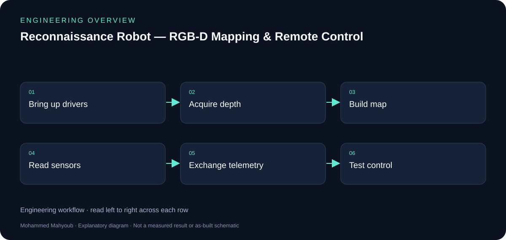

# Reconnaissance Robot — RGB-D Mapping & Remote Control

[Read case study](https://mahyoub88.github.io/projects/proj-reconnaissance-robot/) · [Project index](docs/PROJECTS.md) · [Engineering guide](docs/engineering-guide.md)

## Illustrated implementation walkthrough

### Reconnaissance rover — component integration

[Open the scalable diagram](docs/visuals/robot-system-illustration.svg).

### Reconnaissance rover — data and control paths

[Open the scalable diagram](docs/visuals/robot-data-paths.svg).

The rover illustration brings the documented interfaces into one view: Kinect supplies RGB-D data over USB to Linux/RTAB-Map, while ultrasonic mapping, control, sensor telemetry and GPS/GSM reporting have separate responsibilities. The data-path diagram explains why these links must be reviewed independently during integration.

*These visuals were designed for this documentation. They explain the implemented scope; placement and geometry are illustrative, and the figures are not installation photographs, circuit schematics or new test results.*

## Implementation at a glance

Designed, programmed, assembled, integrated and tested a four-motor reconnaissance rover with RGB-D mapping, sensing, telemetry and remote control.

| Responsibility | Documented implementation |
|---|---|
| 3D mapping | Kinect colour/depth acquisition over USB feeds RTAB-Map on Linux. |
| 2D mapping | Ultrasonic sensing forms a separate mapping path. |
| Control and telemetry | Touchscreen control, nRF commands, XBee sensor telemetry and Bluetooth mapping data serve distinct channels. |
| Location reporting | GPS/GSM provides location reporting. |
| Integration decision | Linux builds and Kinect drivers required compatibility work; the wired USB depth-data path was retained. |

The implemented scope is documented in the public project description. Physical-build photographs, raw maps and source code are not in this public repository; the diagrams below explain the system without posing as build photographs.

### Architecture and implementation workflow

*Documentation diagrams based on the project scope; original source images and results are captioned separately.*

[Full engineering guide](docs/engineering-guide.md) · [Illustrated case study](https://mahyoub88.github.io/projects/proj-reconnaissance-robot/)

---

**Author:** Mohammed Mahyoub.

Designed, programmed, integrated and tested a reconnaissance rover combining Kinect-based 3D mapping, ultrasonic 2D mapping, environmental sensing, GPS/GSM reporting and remote control.

## Role

End-to-end implementation: system design, programming, assembly, integration, testing and documentation.

## Mapping

Integrated a Microsoft Kinect RGB-D sensor with RTAB-Map on Linux; built the required software and sensor drivers. Used ultrasonic sensing for 2D mapping.

## Interfaces

Integrated a four-motor rover, a touchscreen controller, XBee sensor telemetry, nRF control, Bluetooth mapping data and GPS/GSM location reporting.

## Integration

Resolved software-build and Kinect-driver compatibility issues; retained a wired USB connection for Kinect depth data.

## Technologies

RGB-D, Kinect, RTAB-Map, Linux, Embedded Systems, Telemetry, GPS / GSM

## Links

- [Portfolio project](https://mahyoub88.github.io/projects/proj-reconnaissance-robot/)
